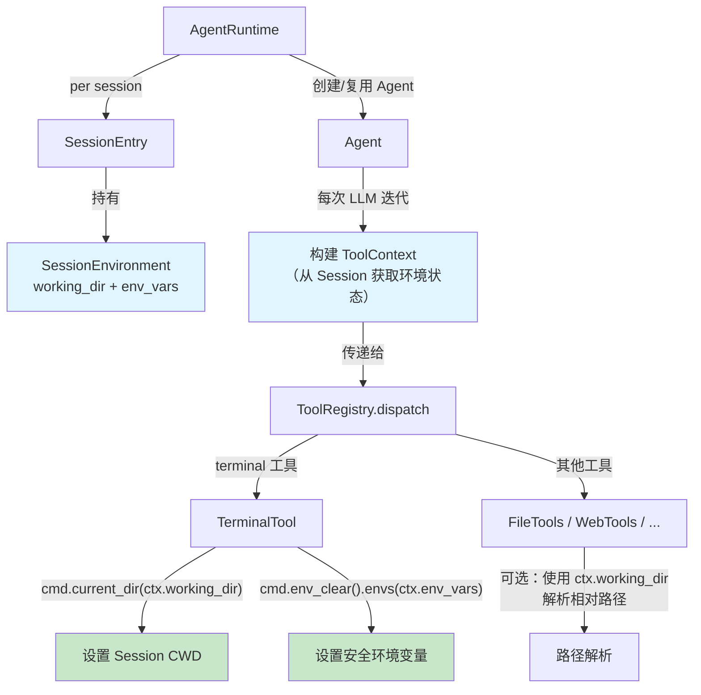
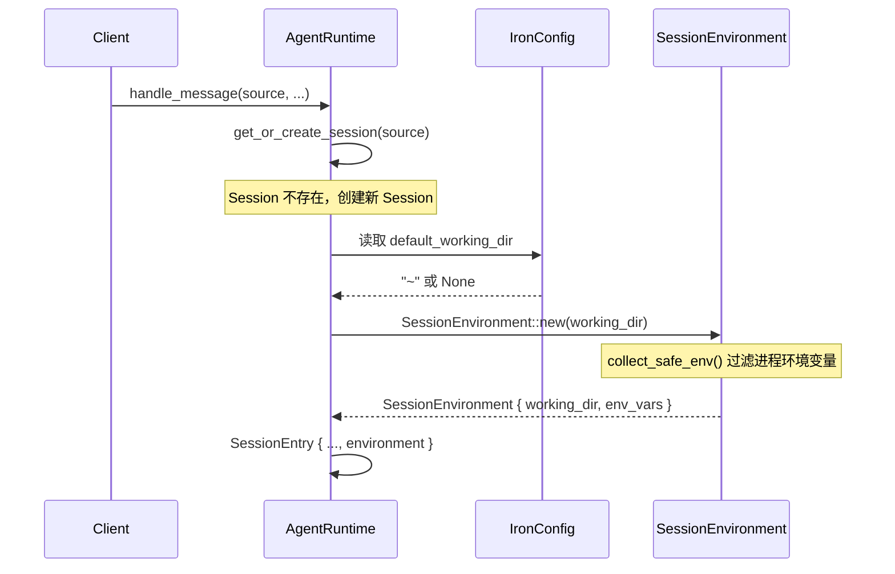
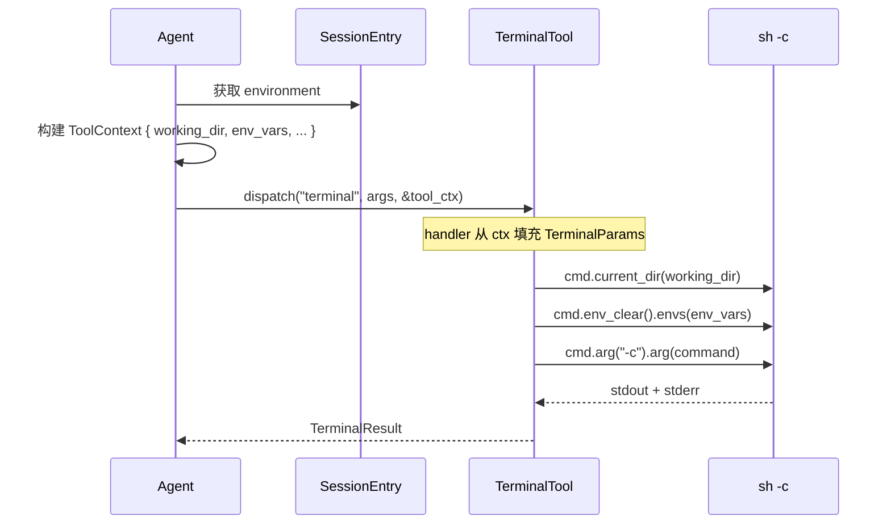

# Session 环境隔离设计

> 日期: 2026-04-15
> 状态: 设计中
> 关联: [feature-gap-analysis](2026-04-12-feature-gap-analysis.md) Session 表格中的"环境隔离"项

- [Session 环境隔离设计](#session-环境隔离设计)
  - [1. 背景与问题](#1-背景与问题)
    - [1.1 现状](#11-现状)
    - [1.2 风险场景](#12-风险场景)
  - [2. 设计目标](#2-设计目标)
  - [3. 设计决策](#3-设计决策)
    - [3.1 隔离级别：轻量级](#31-隔离级别轻量级)
    - [3.2 CWD 持久化：不持久化](#32-cwd-持久化不持久化)
    - [3.3 环境变量策略：白名单过滤](#33-环境变量策略白名单过滤)
  - [4. 整体架构](#4-整体架构)
  - [5. 详细设计](#5-详细设计)
    - [5.1 SessionEnvironment 结构体](#51-sessionenvironment-结构体)
    - [5.2 ToolContext 扩展](#52-toolcontext-扩展)
    - [5.3 SessionEntry 扩展](#53-sessionentry-扩展)
    - [5.4 Agent 构建 ToolContext 的变更](#54-agent-构建-toolcontext-的变更)
    - [5.5 TerminalTool 执行变更](#55-terminaltool-执行变更)
    - [5.6 Sandbox 复用安全环境变量逻辑](#56-sandbox-复用安全环境变量逻辑)
    - [5.7 配置支持](#57-配置支持)
  - [6. 数据流](#6-数据流)
    - [6.1 Session 创建时](#61-session-创建时)
    - [6.2 命令执行时](#62-命令执行时)
  - [7. 文件变更范围](#7-文件变更范围)
    - [新增文件](#新增文件)
    - [修改文件](#修改文件)
    - [不变的文件](#不变的文件)
  - [8. 测试策略](#8-测试策略)
    - [单元测试](#单元测试)
    - [集成测试](#集成测试)
  - [9. 方案评估](#9-方案评估)

## 1. 背景与问题

### 1.1 现状

当前 iron-hermes 的 `TerminalTool` 在执行命令时，所有 Session 共享同一个进程级环境：

- **工作目录**：`ToolContext.working_dir` 取自 `std::env::current_dir()`（进程 CWD），所有 Session 看到相同的值
- **环境变量**：`Command::new("sh")` 默认继承父进程的全部环境变量，包括可能包含敏感信息的 `API_KEY`、`TOKEN` 等
- **进程状态**：每次命令都是独立的 `sh -c` 子进程，无跨命令状态

相关代码位置：

| 组件 | 文件 | 行号 |
|------|------|------|
| ToolContext 定义 | `crates/iron-tool-api/src/types.rs` | 12-17 |
| ToolContext 构建 | `crates/iron-core/src/agent.rs` | 240-244 |
| TerminalTool 执行 | `crates/iron-tools/src/terminal.rs` | 42-69 |
| SessionEntry 定义 | `crates/iron-core/src/runtime.rs` | 44-58 |

### 1.2 风险场景

1. **敏感信息泄漏**：LLM 执行 `env` 或 `printenv` 命令可获取进程中所有环境变量，包括 `LLM_API_KEY` 等敏感信息
2. **端口冲突**：多个 Session 同时启动相同端口的服务
3. **文件竞争**：多个 Session 操作相同路径下的临时文件或构建产物
4. **CWD 混淆**：不同 Session 期望在不同目录下工作，但 `ToolContext.working_dir` 始终是进程 CWD

## 2. 设计目标

1. 每个 Session 拥有独立的默认工作目录
2. 终端命令执行时使用安全的环境变量集，过滤敏感信息
3. 与现有架构自然融合，不引入新的进程管理复杂度
4. 复用 Sandbox 已有的环境变量过滤逻辑，避免重复实现

## 3. 设计决策

### 3.1 隔离级别：轻量级

**决策**：采用轻量级隔离（per-session 状态传递），不采用重量级隔离（独立进程/容器）。

**依据**：
- hermes-agent 采用相同的轻量级方案，验证了其可行性
- 重量级隔离引入进程生命周期管理、僵尸进程、资源限制等复杂度，但当前并发 Session 数量有限，收益不匹配
- 轻量级方案可靠性更高，不存在进程崩溃/僵死的风险

### 3.2 CWD 持久化：不持久化

**决策**：不拦截 `cd` 命令来更新 session 级 CWD。每条命令在 session 的默认工作目录下执行，LLM 可通过 `workdir` 参数显式覆盖。

**依据**：
- hermes-agent 采用相同策略，通过系统提示词要求 LLM 使用绝对路径
- `cd` 拦截需要解析 shell 命令语义（`cd`、`pushd`、`&&` 链等），复杂且不可靠
- 显式 `workdir` 参数更可控、可审计

### 3.3 环境变量策略：白名单过滤

**决策**：采用白名单机制，只传递安全的环境变量给子进程。复用 `iron-sandbox` 中已有的过滤逻辑。

**依据**：
- `iron-sandbox` 已实现成熟的白名单过滤（`SAFE_PREFIXES`）和敏感词检测（`SECRET_PATTERNS`），经过验证
- 白名单比黑名单更安全 — 新增的敏感变量默认被阻止，无需逐一排除
- 复用已有逻辑避免重复实现和维护两套规则

## 4. 整体架构



## 5. 详细设计

### 5.1 SessionEnvironment 结构体

在 `iron-core` 中新增 `SessionEnvironment`，封装 per-session 的终端环境状态：

```rust
// crates/iron-core/src/session/environment.rs

use std::collections::HashMap;
use std::path::PathBuf;

/// Per-session terminal environment state.
#[derive(Debug, Clone)]
pub struct SessionEnvironment {
    /// Default working directory for this session.
    /// Commands without explicit `workdir` will execute in this directory.
    pub working_dir: PathBuf,

    /// Safe environment variables for this session.
    /// Filtered from process env using whitelist + secret blocking.
    pub env_vars: HashMap<String, String>,
}

impl SessionEnvironment {
    /// Create a new session environment with the given working directory.
    /// Environment variables are collected by filtering the current process
    /// env through the safe-env whitelist from `iron-sandbox`.
    pub fn new(working_dir: PathBuf) -> Self {
        let env_vars = collect_safe_env();
        Self {
            working_dir,
            env_vars,
        }
    }
}
```

### 5.2 ToolContext 扩展

在 `ToolContext` 中增加 `env_vars` 字段：

```rust
// crates/iron-tool-api/src/types.rs

#[derive(Debug, Clone)]
pub struct ToolContext {
    pub task_id: String,
    pub working_dir: std::path::PathBuf,
    pub enabled_tools: HashSet<String>,
    /// Safe environment variables for the current session.
    /// Terminal tools should use these instead of inheriting process env.
    pub env_vars: HashMap<String, String>,
}
```

### 5.3 SessionEntry 扩展

在 `SessionEntry` 中持有 `SessionEnvironment`：

```rust
// crates/iron-core/src/runtime.rs

#[derive(Debug, Clone)]
pub struct SessionEntry {
    pub session_id: String,
    pub session_key: String,
    pub source: SessionSource,
    pub created_at: Instant,
    pub updated_at: Instant,
    pub input_tokens: u64,
    pub output_tokens: u64,
    pub message_count: u32,
    pub last_model: Option<String>,
    pub turns_since_review: u32,
    /// Per-session terminal environment (working dir + safe env vars).
    pub environment: SessionEnvironment,
}
```

Session 创建时（`get_or_create_session`），使用配置的默认工作目录初始化 `SessionEnvironment`。

### 5.4 Agent 构建 ToolContext 的变更

Agent 在构建 `ToolContext` 时，从 Session 环境获取 `working_dir` 和 `env_vars`，替代进程级 CWD：

```rust
// crates/iron-core/src/agent.rs  (原 240-244 行)

// 变更前：
let tool_ctx = ToolContext {
    task_id: self.session.session_id.clone(),
    working_dir: std::env::current_dir().unwrap_or_default(),
    enabled_tools: tool_names.clone(),
};

// 变更后：
let tool_ctx = ToolContext {
    task_id: self.session.session_id.clone(),
    working_dir: self.environment.working_dir.clone(),
    enabled_tools: tool_names.clone(),
    env_vars: self.environment.env_vars.clone(),
};
```

这要求 `Agent` 在创建或从 Runtime 获取时，接收 `SessionEnvironment` 的引用。具体传递方式：`AgentRuntime` 在调用 `agent.chat()` 前，将 `SessionEntry.environment` 的克隆注入到 Agent 中。

### 5.5 TerminalTool 执行变更

`TerminalTool::execute` 从 `ToolContext` 获取环境状态：

```rust
// crates/iron-tools/src/terminal.rs  (原 48-56 行)

// 变更前：
let mut cmd = Command::new("sh");
cmd.arg("-c").arg(&params.command);
cmd.stdin(std::process::Stdio::null());
cmd.stdout(std::process::Stdio::piped());
cmd.stderr(std::process::Stdio::piped());

if let Some(dir) = &params.workdir {
    cmd.current_dir(dir);
}

// 变更后：
let mut cmd = Command::new("sh");
cmd.arg("-c").arg(&params.command);
cmd.stdin(std::process::Stdio::null());
cmd.stdout(std::process::Stdio::piped());
cmd.stderr(std::process::Stdio::piped());

// 工作目录：命令显式指定 > session 默认 > 进程 CWD
if let Some(dir) = &params.workdir {
    cmd.current_dir(dir);
} else {
    cmd.current_dir(&ctx.working_dir);
}

// 环境变量：使用 session 级安全环境变量，阻止敏感信息泄漏
cmd.env_clear();
cmd.envs(&ctx.env_vars);
```

这要求修改 `TerminalTool::execute` 的签名，增加 `ctx: &ToolContext` 参数；或者在 `terminal_module.rs` 的 handler 闭包中，将 `ToolContext` 中的环境信息提取后传入。

考虑到 `TerminalTool::execute` 目前只接收 `TerminalParams`，更合理的做法是扩展 `TerminalParams`：

```rust
pub struct TerminalParams {
    pub command: String,
    pub background: bool,
    pub timeout: Option<u64>,
    pub workdir: Option<PathBuf>,
    /// Session-level safe environment variables.
    /// If provided, cmd.env_clear() + cmd.envs() will be used.
    pub env_vars: Option<HashMap<String, String>>,
}
```

在 `terminal_module.rs` 的 handler 中，从 `ToolContext` 填充这些字段：

```rust
// terminal_module.rs handler 闭包中
let params = TerminalParams {
    command,
    background,
    timeout,
    workdir: workdir.or(Some(ctx.working_dir.clone())),
    env_vars: Some(ctx.env_vars.clone()),
};
```

### 5.6 Sandbox 复用安全环境变量逻辑

当前环境变量过滤逻辑位于 `iron-sandbox/src/sandbox.rs`：

- `SAFE_PREFIXES`: `PATH`, `HOME`, `USER`, `LANG`, `LC_`, `TERM`, `TMPDIR`, `TZ`, `SHELL`
- `SECRET_PATTERNS`: `KEY`, `TOKEN`, `SECRET`, `PASSWORD`, `CREDENTIAL`, `PASSWD`, `AUTH`
- `is_safe_env_var()` 和 `collect_safe_env()` 函数

**复用方案**：将 `is_safe_env_var`、`collect_safe_env`、`SAFE_PREFIXES`、`SECRET_PATTERNS` 提取到一个公共位置。两种选择：

1. **提取到 `iron-tool-api`**：作为工具层的公共工具函数，`iron-sandbox` 和 `SessionEnvironment` 都依赖它
2. **提取到独立的 `iron-env` crate**：如果不想让 `iron-tool-api` 承担过多职责

考虑到这些函数职责明确（过滤环境变量），且与工具执行紧密相关，放在 `iron-tool-api` 中较为合理，在其中新增 `env.rs` 模块。

### 5.7 配置支持

在 `config.yaml` 的 `session` 段中新增默认工作目录配置：

```yaml
session:
  idle_timeout: 1800
  # Session 终端命令的默认工作目录
  # 支持 ~ 和环境变量展开
  # 不配置则使用进程启动时的 CWD
  default_working_dir: "~"
```

对应 `IronConfig` 扩展：

```rust
pub struct SessionSection {
    pub idle_timeout: u64,
    /// Default working directory for new sessions.
    /// If not set, uses the process CWD at startup.
    pub default_working_dir: Option<String>,
}
```

## 6. 数据流

### 6.1 Session 创建时



### 6.2 命令执行时



## 7. 文件变更范围

### 新增文件

| 文件 | 说明 |
|------|------|
| `crates/iron-core/src/session/environment.rs` | `SessionEnvironment` 结构体 |
| `crates/iron-tool-api/src/env.rs` | 公共环境变量过滤函数（从 sandbox 提取） |

### 修改文件

| 文件 | 变更内容 |
|------|----------|
| `crates/iron-tool-api/src/types.rs` | `ToolContext` 增加 `env_vars` 字段 |
| `crates/iron-tool-api/src/lib.rs` | 导出 `env` 模块 |
| `crates/iron-core/src/runtime.rs` | `SessionEntry` 增加 `environment` 字段；`get_or_create_session` 初始化环境 |
| `crates/iron-core/src/agent.rs` | `ToolContext` 构建逻辑变更，从 session 环境获取 |
| `crates/iron-core/src/session/mod.rs` | 导出 `environment` 模块 |
| `crates/iron-tools/src/terminal.rs` | `TerminalParams` 增加 `env_vars`；`execute` 使用 `env_clear` + `envs` |
| `crates/iron-tools/src/terminal_module.rs` | handler 从 `ToolContext` 填充 `workdir` 和 `env_vars` |
| `crates/iron-sandbox/src/sandbox.rs` | `is_safe_env_var`、`collect_safe_env` 等改为引用 `iron-tool-api::env` |
| `crates/iron-server/src/config.rs` | `SessionSection` 增加 `default_working_dir` |
| `crates/iron-server/src/default_config.yaml` | 增加 `default_working_dir` 配置项 |

### 不变的文件

| 文件 | 原因 |
|------|------|
| `crates/iron-tools/src/file_tools.rs` | 文件工具已有独立的路径处理逻辑 |
| `crates/iron-tools/src/web_tools.rs` | Web 工具与终端环境无关 |
| `crates/iron-core/src/session/store.rs` | 环境状态为运行时状态，不持久化到 SQLite |

## 8. 测试策略

### 单元测试

| 测试项 | 文件 | 验证内容 |
|--------|------|----------|
| 环境变量过滤 | `iron-tool-api/src/env.rs` | `is_safe_env_var` 对安全/危险变量的判定 |
| SessionEnvironment 初始化 | `iron-core/src/session/environment.rs` | `new()` 正确过滤环境变量 |
| TerminalTool 环境隔离 | `iron-tools/tests/terminal_test.rs` | 命令执行时不继承敏感环境变量 |
| TerminalTool CWD 优先级 | `iron-tools/tests/terminal_test.rs` | 显式 workdir > session CWD > 进程 CWD |

### 集成测试

| 测试项 | 验证内容 |
|--------|----------|
| 多 Session 隔离 | 两个 Session 设置不同 CWD，各自执行 `pwd` 返回正确路径 |
| 敏感信息阻断 | 设置 `LLM_API_KEY` 环境变量后，Session 中执行 `env` 命令不包含该变量 |
| 配置生效 | `config.yaml` 中设置 `default_working_dir`，新 Session 使用该目录 |

## 9. 方案评估

| 维度 | 评估 |
|------|------|
| **可行性** | 所有变更基于现有架构的自然扩展，不引入新的基础设施依赖 |
| **完整性** | 覆盖工作目录隔离和环境变量隔离两个核心需求；不支持 `cd` 持久化，与 hermes-agent 策略一致 |
| **可靠性** | 无长驻进程、无状态同步问题；环境变量过滤复用 Sandbox 已验证的逻辑 |
| **系统影响** | 主要影响 `ToolContext` 公共类型，需要所有工具适配新字段；运行时开销仅为 per-session 的 `HashMap<String, String>` 克隆，可忽略不计 |
