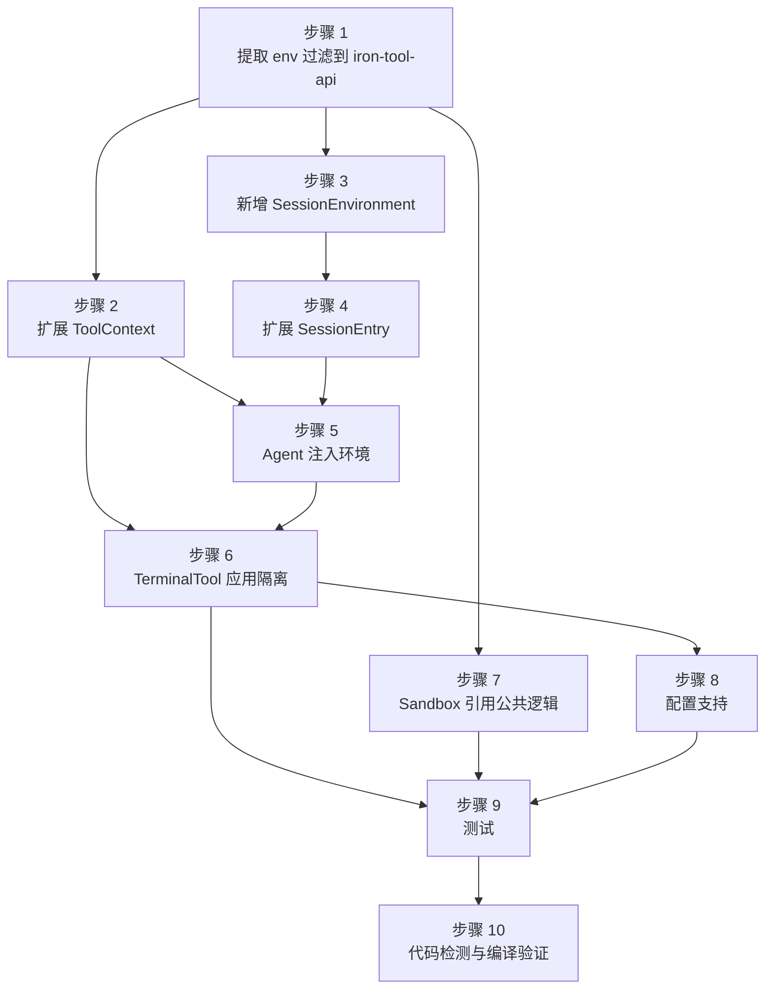

# Session 环境隔离 — 实施计划

> 日期: 2026-04-15
> 设计文档: [session-env-isolation-design.md](2026-04-15-session-env-isolation-design.md)
> 分支: feat/session-env-isolation

- [Session 环境隔离 — 实施计划](#session-环境隔离--实施计划)
  - [实施概览](#实施概览)
  - [步骤 1：提取环境变量过滤逻辑到 iron-tool-api](#步骤-1提取环境变量过滤逻辑到-iron-tool-api)
  - [步骤 2：扩展 ToolContext](#步骤-2扩展-toolcontext)
  - [步骤 3：新增 SessionEnvironment](#步骤-3新增-sessionenvironment)
  - [步骤 4：扩展 SessionEntry 和 AgentRuntime](#步骤-4扩展-sessionentry-和-agentruntime)
  - [步骤 5：Agent 注入 SessionEnvironment](#步骤-5agent-注入-sessionenvironment)
  - [步骤 6：TerminalTool 应用环境隔离](#步骤-6terminaltool-应用环境隔离)
  - [步骤 7：Sandbox 改为引用公共过滤逻辑](#步骤-7sandbox-改为引用公共过滤逻辑)
  - [步骤 8：配置支持 default\_working\_dir](#步骤-8配置支持-default_working_dir)
  - [步骤 9：测试](#步骤-9测试)
    - [9.1 单元测试](#91-单元测试)
    - [9.2 集成测试](#92-集成测试)
    - [9.3 现有测试回归](#93-现有测试回归)
  - [步骤 10：代码检测与编译验证](#步骤-10代码检测与编译验证)
  - [依赖关系](#依赖关系)
  - [风险与缓解](#风险与缓解)

## 实施概览

共 10 个步骤，按依赖顺序排列。步骤 1-3 是基础层变更，步骤 4-6 是核心逻辑变更，步骤 7-8 是适配和配置，步骤 9-10 是验证。

## 步骤 1：提取环境变量过滤逻辑到 iron-tool-api

**目标**：将 `iron-sandbox` 中的环境变量过滤函数提取到 `iron-tool-api`，作为公共模块供 `TerminalTool` 和 `Sandbox` 共同使用。

**变更文件**：

| 操作 | 文件 |
|------|------|
| 新增 | `crates/iron-tool-api/src/env.rs` |
| 修改 | `crates/iron-tool-api/src/lib.rs` |

**具体变更**：

1. 新增 `crates/iron-tool-api/src/env.rs`，从 `iron-sandbox/src/sandbox.rs`（第 54-91 行）迁移以下内容：
   - `SAFE_PREFIXES` 常量
   - `SECRET_PATTERNS` 常量
   - `is_safe_env_var()` 函数
   - `collect_safe_env()` 函数
   - 所有函数标记为 `pub`

2. 修改 `crates/iron-tool-api/src/lib.rs`，增加：
   ```rust
   pub mod env;
   ```

**验证**：`cargo build -p iron-tool-api`

---

## 步骤 2：扩展 ToolContext

**目标**：在 `ToolContext` 中增加 `env_vars` 字段，使工具能够获取 session 级安全环境变量。

**变更文件**：

| 操作 | 文件 |
|------|------|
| 修改 | `crates/iron-tool-api/src/types.rs` |

**具体变更**：

修改 `ToolContext` 结构体（第 12-17 行），增加 `env_vars` 字段：

```rust
// 变更前（第 12-17 行）：
#[derive(Debug, Clone)]
pub struct ToolContext {
    pub task_id: String,
    pub working_dir: std::path::PathBuf,
    pub enabled_tools: HashSet<String>,
}

// 变更后：
#[derive(Debug, Clone)]
pub struct ToolContext {
    pub task_id: String,
    pub working_dir: std::path::PathBuf,
    pub enabled_tools: HashSet<String>,
    /// Safe environment variables for the current session.
    pub env_vars: HashMap<String, String>,
}
```

需要在文件顶部增加 `use std::collections::HashMap;`。

**编译影响**：此变更会导致所有构建 `ToolContext` 的代码编译失败，需要在步骤 5 中修复 `agent.rs` 中的构建逻辑。在此步骤中，临时在变更处使用 `#[allow(dead_code)]` 或者先不编译，等步骤 5 一并修复。

---

## 步骤 3：新增 SessionEnvironment

**目标**：在 `iron-core` 中新增 `SessionEnvironment` 结构体，封装 per-session 终端环境状态。

**变更文件**：

| 操作 | 文件 |
|------|------|
| 新增 | `crates/iron-core/src/session/environment.rs` |
| 修改 | `crates/iron-core/src/session/mod.rs` |

**具体变更**：

1. 新增 `crates/iron-core/src/session/environment.rs`：

```rust
use std::collections::HashMap;
use std::path::PathBuf;

use iron_tool_api::env::collect_safe_env;

/// Per-session terminal environment state.
#[derive(Debug, Clone)]
pub struct SessionEnvironment {
    /// Default working directory for this session.
    pub working_dir: PathBuf,
    /// Safe environment variables for this session.
    pub env_vars: HashMap<String, String>,
}

impl SessionEnvironment {
    /// Create with the given working directory.
    /// Environment variables are collected by filtering the current process
    /// env through the safe-env whitelist.
    pub fn new(working_dir: PathBuf) -> Self {
        let env_vars = collect_safe_env();
        Self {
            working_dir,
            env_vars,
        }
    }
}
```

2. 修改 `crates/iron-core/src/session/mod.rs`（当前内容为第 1-5 行），增加 `environment` 模块导出：

```rust
// 变更前：
pub mod store;
pub mod types;

pub use store::SessionStore;
pub use types::{Session, SessionMessage, TokenUsage};

// 变更后：
pub mod environment;
pub mod store;
pub mod types;

pub use environment::SessionEnvironment;
pub use store::SessionStore;
pub use types::{Session, SessionMessage, TokenUsage};
```

**验证**：`cargo build -p iron-core`（可能因步骤 2 的 ToolContext 变更失败，步骤 5 后统一验证）

---

## 步骤 4：扩展 SessionEntry 和 AgentRuntime

**目标**：在 `SessionEntry` 中持有 `SessionEnvironment`，在 Session 创建时初始化环境。

**变更文件**：

| 操作 | 文件 |
|------|------|
| 修改 | `crates/iron-core/src/runtime.rs` |

**具体变更**：

1. 在文件顶部增加导入：
   ```rust
   use crate::session::SessionEnvironment;
   ```

2. 扩展 `SessionEntry`（第 44-58 行），增加 `environment` 字段：
   ```rust
   pub struct SessionEntry {
       // ... 现有字段保持不变 ...
       pub turns_since_review: u32,
       /// Per-session terminal environment (working dir + safe env vars).
       pub environment: SessionEnvironment,
   }
   ```

3. 修改 `get_or_create_session`（第 189-216 行），在创建 `SessionEntry` 时初始化 `environment`：
   ```rust
   let default_working_dir = self.config.read().await.default_working_dir.clone();
   let working_dir = default_working_dir
       .map(|d| {
           let expanded = shellexpand::tilde(&d).to_string();
           PathBuf::from(expanded)
       })
       .unwrap_or_else(|| std::env::current_dir().unwrap_or_default());

   let entry = SessionEntry {
       // ... 现有字段 ...
       turns_since_review: 0,
       environment: SessionEnvironment::new(working_dir),
   };
   ```

4. 扩展 `RuntimeConfig`，增加 `default_working_dir` 字段：
   ```rust
   pub struct RuntimeConfig {
       // ... 现有字段 ...
       /// Default working directory for new sessions.
       pub default_working_dir: Option<String>,
   }
   ```

5. 修改所有创建 `RuntimeConfig` 的地方，补充新字段的初始化。

**注意**：需要在 `Cargo.toml` 中为 `iron-core` 添加 `shellexpand` 依赖（用于 `~` 路径展开）。

---

## 步骤 5：Agent 注入 SessionEnvironment

**目标**：Agent 在构建 `ToolContext` 时从 `SessionEnvironment` 获取 `working_dir` 和 `env_vars`，替代进程级 CWD。

**变更文件**：

| 操作 | 文件 |
|------|------|
| 修改 | `crates/iron-core/src/agent.rs` |
| 修改 | `crates/iron-core/src/runtime.rs` |

**具体变更**：

1. **Agent 结构体**（`agent.rs` 第 99-109 行）增加 `environment` 字段：

   ```rust
   pub struct Agent {
       // ... 现有字段 ...
       todo_state: Option<TodoState>,
       /// Per-session terminal environment.
       environment: SessionEnvironment,
   }
   ```

2. **Agent::new**（`agent.rs` 第 113-137 行）增加 `environment` 参数：

   ```rust
   pub fn new(
       llm_client: LlmClient,
       tool_registry: Arc<ToolRegistry>,
       memory_manager: Arc<Mutex<MemoryManager>>,
       skill_manager: Arc<SkillManager>,
       config: AgentConfig,
       todo_event_rx: Option<TodoEventReceiver>,
       todo_state: Option<TodoState>,
       environment: SessionEnvironment,
   ) -> Self {
       // ...
       Self {
           // ... 现有字段 ...
           todo_state,
           environment,
       }
   }
   ```

3. **ToolContext 构建**（`agent.rs` 第 240-244 行）：

   ```rust
   // 变更前：
   let tool_ctx = ToolContext {
       task_id: self.session.session_id.clone(),
       working_dir: std::env::current_dir().unwrap_or_default(),
       enabled_tools: tool_names.clone(),
   };

   // 变更后：
   let tool_ctx = ToolContext {
       task_id: self.session.session_id.clone(),
       working_dir: self.environment.working_dir.clone(),
       enabled_tools: tool_names.clone(),
       env_vars: self.environment.env_vars.clone(),
   };
   ```

4. **AgentRuntime 创建 Agent 时传入 environment**（`runtime.rs` 中 `get_or_create_agent` 方法）：
   从 `SessionEntry.environment` 克隆并传入 `Agent::new`。

**验证**：此步骤完成后，步骤 2 引入的编译错误应全部修复。运行 `cargo build -p iron-core`。

---

## 步骤 6：TerminalTool 应用环境隔离

**目标**：`TerminalTool` 执行命令时使用 `ToolContext` 中的 CWD 和安全环境变量。

**变更文件**：

| 操作 | 文件 |
|------|------|
| 修改 | `crates/iron-tools/src/terminal.rs` |
| 修改 | `crates/iron-tools/src/terminal_module.rs` |

**具体变更**：

1. **TerminalParams**（`terminal.rs` 第 12-18 行）增加 `env_vars` 字段：

   ```rust
   pub struct TerminalParams {
       pub command: String,
       pub background: bool,
       pub timeout: Option<u64>,
       pub workdir: Option<PathBuf>,
       /// Session-level safe environment variables.
       /// If Some, cmd.env_clear() + cmd.envs() will be applied.
       pub env_vars: Option<HashMap<String, String>>,
   }
   ```

2. **TerminalTool::execute**（`terminal.rs` 第 42-69 行）应用环境变量：

   ```rust
   // 在 cmd.current_dir 逻辑之后（第 56 行之后），增加：
   if let Some(ref env_vars) = params.env_vars {
       cmd.env_clear();
       cmd.envs(env_vars);
   }
   ```

3. **terminal_module.rs handler**（第 51-83 行）从 `ToolContext` 填充 `workdir` 和 `env_vars`：

   ```rust
   // 变更前（第 62-69 行）：
   let workdir = args["workdir"].as_str().map(std::path::PathBuf::from);

   let params = TerminalParams {
       command,
       background: false,
       timeout,
       workdir,
   };

   // 变更后：
   let workdir = args["workdir"]
       .as_str()
       .map(std::path::PathBuf::from)
       .or_else(|| Some(ctx.working_dir.clone()));

   let params = TerminalParams {
       command,
       background: false,
       timeout,
       workdir,
       env_vars: Some(ctx.env_vars.clone()),
   };
   ```

   注意：handler 闭包签名为 `move |args: Value, _ctx|`，需要将 `_ctx` 改为 `ctx` 以使用 `ToolContext`。

**验证**：`cargo build -p iron-tools`

---

## 步骤 7：Sandbox 改为引用公共过滤逻辑

**目标**：`iron-sandbox` 改为引用 `iron-tool-api::env` 中的公共函数，删除本地副本。

**变更文件**：

| 操作 | 文件 |
|------|------|
| 修改 | `crates/iron-sandbox/src/sandbox.rs` |
| 修改 | `crates/iron-sandbox/Cargo.toml` |

**具体变更**：

1. 确认 `iron-sandbox/Cargo.toml` 已依赖 `iron-tool-api`（当前应已有此依赖，因为 Sandbox 使用 `ToolRegistry`）。

2. 修改 `sandbox.rs`：
   - 删除 `SAFE_PREFIXES`（第 55-57 行）
   - 删除 `SECRET_PATTERNS`（第 60-68 行）
   - 删除 `is_safe_env_var()`（第 70-85 行）
   - 删除 `collect_safe_env()`（第 87-91 行）
   - 在文件顶部增加：`use iron_tool_api::env::collect_safe_env;`
   - 如果 `redact_secrets()` 仍引用 `SECRET_PATTERNS`，需要也改为引用公共模块，或保持 `redact_secrets` 独立（它的正则模式与 `SECRET_PATTERNS` 不同，可以保留）

**验证**：`cargo build -p iron-sandbox`

---

## 步骤 8：配置支持 default_working_dir

**目标**：在 `config.yaml` 中支持 `session.default_working_dir` 配置项。

**变更文件**：

| 操作 | 文件 |
|------|------|
| 修改 | `crates/iron-server/src/config.rs` |
| 修改 | `crates/iron-server/src/default_config.yaml` |
| 修改 | `crates/iron-server/src/state.rs`（构建 RuntimeConfig 的地方） |

**具体变更**：

1. **config.rs** `SessionSection`（第 115-119 行）增加字段：

   ```rust
   #[derive(Debug, Clone, Serialize, Deserialize)]
   pub struct SessionSection {
       #[serde(default = "defaults::session_idle_timeout")]
       pub idle_timeout: u64,
       /// Default working directory for new sessions.
       /// Supports ~ expansion. If not set, uses process CWD.
       #[serde(default)]
       pub default_working_dir: Option<String>,
   }
   ```

2. **default_config.yaml** 在 `session` 段增加注释：

   ```yaml
   session:
     idle_timeout: 1800
     # default_working_dir: "~"  # Session 终端命令的默认工作目录（支持 ~ 展开）
   ```

3. **state.rs**（或其他构建 `RuntimeConfig` 的位置）将 `config.session.default_working_dir` 传入 `RuntimeConfig`。

**验证**：`cargo build -p iron-server`

---

## 步骤 9：测试

**目标**：为环境隔离功能编写单元测试和集成测试。

### 9.1 单元测试

**新增/修改文件**：

| 文件 | 测试内容 |
|------|----------|
| `crates/iron-tool-api/src/env.rs` | `is_safe_env_var` 对安全变量返回 true，对含 KEY/TOKEN/SECRET 的变量返回 false |
| `crates/iron-core/src/session/environment.rs` | `SessionEnvironment::new()` 正确过滤环境变量，`working_dir` 正确设置 |

### 9.2 集成测试

**新增/修改文件**：

| 文件 | 测试内容 |
|------|----------|
| `crates/iron-tools/tests/terminal_test.rs` | 增加测试用例：传入 `env_vars` 后执行 `env` 命令不包含 `LLM_API_KEY` 等敏感变量 |
| `crates/iron-tools/tests/terminal_test.rs` | 增加测试用例：不传 `workdir` 时使用 `ToolContext.working_dir`；传 `workdir` 时覆盖 |

### 9.3 现有测试回归

运行全量测试确保无回归：

```bash
cargo test --workspace
```

---

## 步骤 10：代码检测与编译验证

按照 CLAUDE.md 中的 Rust 代码检测要求执行：

```bash
cargo fmt
cargo +nightly fmt --all -- --check
cargo +nightly clippy --all-features --workspace -- -D warnings
cargo build --release
```

---

## 依赖关系



**可并行执行的步骤**：
- 步骤 2 和步骤 3 可并行（都只依赖步骤 1）
- 步骤 7 可与步骤 4-6 并行（独立的 Sandbox 适配）
- 步骤 8 可与步骤 7 并行

## 风险与缓解

| 风险 | 影响 | 缓解措施 |
|------|------|----------|
| `ToolContext` 增加字段导致大量编译错误 | 所有创建 `ToolContext` 的地方需更新 | 步骤 2 和步骤 5 一起执行，当前仅 `agent.rs` 一处构建 `ToolContext` |
| `Agent::new` 签名变更影响调用方 | 所有创建 Agent 的地方需更新 | 当前仅 `runtime.rs` 中 `get_or_create_agent` 创建 Agent，影响范围有限 |
| `shellexpand` 新依赖引入 | 增加编译依赖 | 该 crate 轻量且广泛使用，无安全顾虑；也可用手动 `~` 替换代替 |
| `env_clear()` 后某些命令依赖特定环境变量 | 部分 shell 命令可能无法正常工作 | `SAFE_PREFIXES` 已覆盖 `PATH`、`HOME`、`SHELL` 等核心变量；如有遗漏，扩展白名单即可 |
